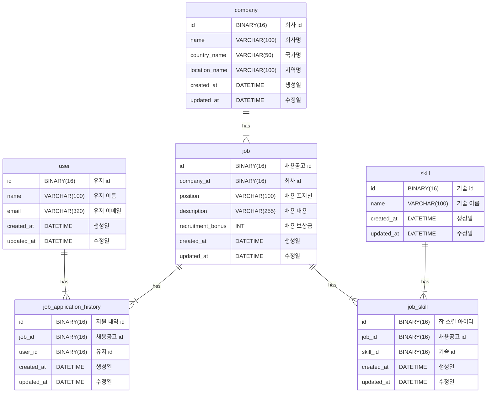

# wanted-pre-onboarding-backend

## [목차](#--)
- [✨ 개요](#----)
    + [프로젝트명](#-----)
    + [목표](#--)
- [📄 기능적 요구사항](#-----------)
- [🛠️ 비기능적 요구사항](#-------------)
- [🏗️ ERD 다이어그램](#----erd------)

# ✨ 개요

### 프로젝트명

- 원티드 프리온보딩 백엔드 프로젝트

### 목표

- 기업의 채용을 위한 서비스 구축

# 📄 기능적 요구사항

1. **채용공고를 등록합니다.**
    - **설명**
        - 회사는 채용공고를 등록할 수 있다.
    - **입력 데이터**
        - `회사 id, 채용포지션, 채용보상금, 채용내용, 사용기술`
    - **출력 데이터**
        - `성공 메시지 or 오류 메시지`
    - **처리 과정**
        1. 회사 id에 유효한 회사가 존재하는지 확인한다.
        2. 존재할 경우 채용공고를 DB에 저장한다.
    - **예외 사항**
        - 회사 id가 존재하지 않을 경우 오류를 발생시킨다.
    - **도표**
        
        ```mermaid
        graph TD
            A((채용공고 등록 요청)) --> B{회사 id 존재 확인}
            B --> |존재| C[채용공고 DB에 저장]
            C --> D((성공 응답 반환))
            B --> |존재하지 않음| E((400 오류 응답 반환))
        ```
        
2. **채용공고를 수정합니다.**
    - **설명**
        - 회사는 채용공고 id를 통해 채용공고를 수정할 수 있다.
    - **입력 데이터**
        - `채용공고 id, 채용포지션, 채용보상금, 채용내용, 사용기술`
        - (회사 id 제외)
    - **출력 데이터**
        - `성공 메시지 or 오류 메시지`
    - **처리 과정**
        1. 채용공고 id에 유효한 채용공고가 존재하는지 확인한다.
        2. 존재할 경우 입력된 데이터를 기반으로 채용공고를 업데이트한다.
    - **예외 사항**
        - 채용공고 id가 존재하지 않을 경우 오류를 발생시킨다.
    - 도표
        
        ```mermaid
        graph TD
            A((채용공고 수정 요청)) --> B{채용공고 id 존재 확인}
            B --> |존재| C[채용공고 DB 업데이트]
            C --> D((성공 응답 반환))
            B --> |존재하지 않음| E((404 오류 응답 반환))
        ```
        
3. **채용공고를 삭제합니다.**
    - **설명**
        - 회사는 채용공고 id를 통해 채용공고를 삭제할 수 있다.
    - **입력 데이터**
        - `채용공고 id`
    - **출력 데이터**
        - `성공 메시지 또는 오류 메시지`
    - **처리 과정**:
        1. 채용공고 id에 유효한 채용공고가 존재하는지 확인한다.
        2. 존재할 경우 해당 채용공고를 DB에서 삭제한다.
    - **예외 사항**
        - 채용공고 id가 존재하지 않을 경우 오류를 발생시킨다.
    - **도표**
        
        ```mermaid
        graph TD
            A((채용공고 삭제 요청)) --> B{채용공고 id 존재 확인}
            B --> |존재| C[채용공고 DB에서 삭제]
            C --> D((성공 응답 반환))
            B --> |존재하지 않음| E((404 오류 응답 반환))
        ```
        
4. **채용공고 목록을 가져옵니다.**
    - **설명**
        - 사용자는 채용공고 목록을 확인할 수 있다.
    - **입력 데이터**
        - `검색어` (선택사항)
    - **출력 데이터**
        - `채용공고 목록`
            - `채용공고 id, 회사명, 국가, 지역, 채용포지션, 채용보상금, 사용기술`
            - (채용 내용 제외)
    - **처리 과정**:
        1. 검색어가 존재하는지 확인한다.
        2. 검색어가 있을 경우 채용공고 DB에 Like 조회 결과를 반환한다.
        3. 검색어가 없을 경우 전체 채용공고를 반환한다.
    - **예외 사항**
        - 조회 결과가 없을 경우 오류가 아닌 빈 목록을 반환한다.
    - **도표**
        
        ```mermaid
        graph TD
            A((채용공고 목록 조회 요청)) --> B{검색어 존재 확인}
            B --> |존재| C[검색어로 채용공고 DB Like 조회]
            B --> |존재하지 않음| G[전체 채용공고 DB 조회]
            C & G --> H[채용공고 목록 반환]
            H --> I((성공 응답 반환))
        ```
        
5. **채용 상세 페이지를 가져옵니다.**
    - **설명**
        - 사용자는 채용공고 id를 통해 채용공고 상세 정보를 확인할 수 있다.
    - **입력 데이터**
        - `채용공고 id`
    - **출력 데이터**
        - `채용공고 id, 회사명, 국가, 지역, 채용포지션, 채용보상금, 사용기술`
        - `채용내용`
        - `해당 회사의 다른 채용공고 목록`
            - `채용공고 id, 채용포지션, 채용보상금, 사용기술`
    - **처리 과정**:
        1. 채용공고 id에 유효한 채용공고가 존재하는지 확인한다.
        2. 존재할 경우 상세 정보를 반환한다.
    - **예외 사항**
        - 채용공고 id가 존재하지 않을 경우 오류를 발생시킨다.
    - 도표
        
        ```mermaid
        graph TD
            A((채용 상세 페이지 조회 요청)) --> B{채용공고 id 존재 확인}
            B --> |존재| C[채용공고 상세 정보 조회]
            C --> |회사 id| D[해당 회사의 채용공고 목록 조회]
            D --> |해당 회사의 채용공고 목록| F[현재 채용공고 제외]
            F --> |해당 회사의 다른 채용공고 목록| G[채용공고 상세 정보와 해당 회사의 다른 채용공고 목록 반환]
            G --> H((성공 응답 반환))
            B --> |존재하지 않음| I((404 오류 응답 반환))
        ```
        
6. **사용자는 채용공고에 지원합니다.**
    - **설명**
        - 사용자는 채용공고에 지원할 수 있다.
    - **입력 데이터**
        - `채용공고 id, 사용자 id`
    - **출력 데이터**
        - `성공 메시지 또는 오류 메시지`
    - **처리 과정**
        1. 해당 사용자가 해당 채용공고에 이미 지원했는지 확인한다.
        2. 지원하지 않았을 경우 지원 정보를 DB에 저장한다.
    - **예외 사항**
        - 중복 지원 시 오류를 발생시킨다.
    - **도표**
        
        ```mermaid
        graph TD
            A((채용공고 지원 요청)) --> B{중복 지원 여부 확인}
            B --> |중복 아님| C[지원 내역 DB에 저장]
            C --> D((성공 응답 반환))
            B --> |중복| E((400 오류 응답 반환))
        ```
        
7. **(참조) 회사, 사용자 등록 절차는 생략합니다.**
    - **설명**
        - 초기 데이터를 위해 회사와 사용자를 DB에 임의로 생성한다.
    - **회사 데이터**
        - `회사 id, 회사명, 국가명, 지역명`
    - **사용자 데이터**
        - `사용자 id, 이름, 이메일`

# 🛠️ 비기능적 요구사항

1. 코드 가독성과 일관성을 지킵니다.
    - 블라블라
2. git commit 컨벤션을 준수합니다.
    - feat: 새로운 기능
    - fix: 버그 수정
    - refactor: 리팩토링
    - chore:  자잘한 수정
    - test: 테스트 코드
    - docs:  문서 생성 및 수정
3. 유닛 테스트를 작성합니다.
    - 블라블라
4. 디렉토리 구조를 논리적으로 배치합니다.
    - 블라블라
5. 디자인패턴을 적절히 사용합니다.
    - 블라블라

# 🏗️ ERD 다이어그램


