# wanted-pre-onboarding-backend

## [목차](#--)
- [✨ 개요](#----)
    + [프로젝트명](#-----)
    + [목표](#--)
- [📄 기능적 요구사항](#-----------)
- [🛠️ 비기능적 요구사항](#-------------)
- [🏗️ ERD 다이어그램](#----erd------)

# ✨ 개요

### 프로젝트명

- 원티드 프리온보딩 백엔드 프로젝트

### 목표

- 기업의 채용을 위한 서비스 구축

# 📄 기능적 요구사항

1. **채용공고를 등록합니다.**
    - **설명**
        - 회사는 채용공고를 등록할 수 있다.
    - **입력 데이터**
        - `회사 id, 채용포지션, 채용보상금, 채용내용, 사용기술`
    - **출력 데이터**
        - `성공 메시지 or 오류 메시지`
    - **처리 과정**
        1. 회사 id에 유효한 회사가 존재하는지 확인한다.
        2. 존재할 경우 채용공고를 DB에 저장한다.
    - **예외 사항**
        - 회사 id가 존재하지 않을 경우 오류를 발생시킨다.
    - **도표**
        
        ```mermaid
        graph TD
            A((채용공고 등록 요청)) --> B{회사 id 존재 확인}
            B --> |존재| C[채용공고 DB에 저장]
            C --> D((성공 응답 반환))
            B --> |존재하지 않음| E((400 오류 응답 반환))
        ```
        
2. **채용공고를 수정합니다.**
    - **설명**
        - 회사는 채용공고 id를 통해 채용공고를 수정할 수 있다.
    - **입력 데이터**
        - `채용공고 id, 채용포지션, 채용보상금, 채용내용, 사용기술`
        - (회사 id 제외)
    - **출력 데이터**
        - `성공 메시지 or 오류 메시지`
    - **처리 과정**
        1. 채용공고 id에 유효한 채용공고가 존재하는지 확인한다.
        2. 존재할 경우 입력된 데이터를 기반으로 채용공고를 업데이트한다.
    - **예외 사항**
        - 채용공고 id가 존재하지 않을 경우 오류를 발생시킨다.
    - 도표
        
        ```mermaid
        graph TD
            A((채용공고 수정 요청)) --> B{채용공고 id 존재 확인}
            B --> |존재| C[채용공고 DB 업데이트]
            C --> D((성공 응답 반환))
            B --> |존재하지 않음| E((404 오류 응답 반환))
        ```
        
3. **채용공고를 삭제합니다.**
    - **설명**
        - 회사는 채용공고 id를 통해 채용공고를 삭제할 수 있다.
    - **입력 데이터**
        - `채용공고 id`
    - **출력 데이터**
        - `성공 메시지 또는 오류 메시지`
    - **처리 과정**:
        1. 채용공고 id에 유효한 채용공고가 존재하는지 확인한다.
        2. 존재할 경우 해당 채용공고를 DB에서 삭제한다.
    - **예외 사항**
        - 채용공고 id가 존재하지 않을 경우 오류를 발생시킨다.
    - **도표**
        
        ```mermaid
        graph TD
            A((채용공고 삭제 요청)) --> B{채용공고 id 존재 확인}
            B --> |존재| C[채용공고 DB에서 삭제]
            C --> D((성공 응답 반환))
            B --> |존재하지 않음| E((404 오류 응답 반환))
        ```
        
4. **채용공고 목록을 가져옵니다.**
    - **설명**
        - 사용자는 채용공고 목록을 확인할 수 있다.
    - **입력 데이터**
        - `검색어` (선택사항)
    - **출력 데이터**
        - `채용공고 목록`
            - `채용공고 id, 회사명, 국가, 지역, 채용포지션, 채용보상금, 사용기술`
            - (채용 내용 제외)
    - **처리 과정**:
        1. 검색어가 존재하는지 확인한다.
        2. 검색어가 있을 경우 채용공고 DB에 Like 조회 결과를 반환한다.
        3. 검색어가 없을 경우 전체 채용공고를 반환한다.
    - **예외 사항**
        - 조회 결과가 없을 경우 오류가 아닌 빈 목록을 반환한다.
    - **도표**
        
        ```mermaid
        graph TD
            A((채용공고 목록 조회 요청)) --> B{검색어 존재 확인}
            B --> |존재| C[검색어로 채용공고 DB Like 조회]
            B --> |존재하지 않음| G[전체 채용공고 DB 조회]
            C & G --> H[채용공고 목록 반환]
            H --> I((성공 응답 반환))
        ```
        
5. **채용 상세 페이지를 가져옵니다.**
    - **설명**
        - 사용자는 채용공고 id를 통해 채용공고 상세 정보를 확인할 수 있다.
    - **입력 데이터**
        - `채용공고 id`
    - **출력 데이터**
        - `채용공고 id, 회사명, 국가, 지역, 채용포지션, 채용보상금, 사용기술`
        - `채용내용`
        - `해당 회사의 다른 채용공고 목록`
            - `채용공고 id, 채용포지션, 채용보상금, 사용기술`
    - **처리 과정**:
        1. 채용공고 id에 유효한 채용공고가 존재하는지 확인한다.
        2. 존재할 경우 상세 정보를 반환한다.
    - **예외 사항**
        - 채용공고 id가 존재하지 않을 경우 오류를 발생시킨다.
    - 도표
        
        ```mermaid
        graph TD
            A((채용 상세 페이지 조회 요청)) --> B{채용공고 id 존재 확인}
            B --> |존재| C[채용공고 상세 정보 조회]
            C --> |회사 id| D[해당 회사의 채용공고 목록 조회]
            D --> |해당 회사의 채용공고 목록| F[현재 채용공고 제외]
            F --> |해당 회사의 다른 채용공고 목록| G[채용공고 상세 정보와 해당 회사의 다른 채용공고 목록 반환]
            G --> H((성공 응답 반환))
            B --> |존재하지 않음| I((404 오류 응답 반환))
        ```
        
6. **사용자는 채용공고에 지원합니다.**
    - **설명**
        - 사용자는 채용공고에 지원할 수 있다.
    - **입력 데이터**
        - `채용공고 id, 사용자 id`
    - **출력 데이터**
        - `성공 메시지 또는 오류 메시지`
    - **처리 과정**
        1. 해당 사용자가 해당 채용공고에 이미 지원했는지 확인한다.
        2. 지원하지 않았을 경우 지원 정보를 DB에 저장한다.
    - **예외 사항**
        - 중복 지원 시 오류를 발생시킨다.
    - **도표**
        
        ```mermaid
        graph TD
            A((채용공고 지원 요청)) --> B{중복 지원 여부 확인}
            B --> |중복 아님| C[지원 내역 DB에 저장]
            C --> D((성공 응답 반환))
            B --> |중복| E((400 오류 응답 반환))
        ```
        
7. **(참조) 회사, 사용자 등록 절차는 생략합니다.**
    - **설명**
        - 초기 데이터를 위해 회사와 사용자를 DB에 임의로 생성한다.
    - **회사 데이터**
        - `회사 id, 회사명, 국가명, 지역명`
    - **사용자 데이터**
        - `사용자 id, 이름, 이메일`

# 🛠️ 비기능적 요구사항

1. 코드 가독성과 일관성을 지킵니다.
    - 코딩 컨벤션 세팅
        - [네이버 코딩 컨벤션](https://github.com/naver/hackday-conventions-java)을 기반하여 세팅하였습니다.
        - `File > Setting > Editor > Code Style > Java`를 설정하여 일관된 코딩 컨벤션을 유지하도록 하였습니다.
        - `Tools > Actions on Save`에서 `Reformat code`와 `Optimize imports` 옵션을 체크하여 저장할 때 포멧팅을 해주도록 하였고 이를 통해 코딩 컨벤션 누락을 방지하도록 하였습니다.
2. git commit 컨벤션을 준수합니다.
    - feat: 새로운 기능
    - fix: 버그 수정
    - refactor: 리팩토링
    - chore:  자잘한 수정
    - test: 테스트 코드
    - docs:  문서 생성 및 수정
3. 유닛 테스트를 작성합니다.
    - 블라블라
4. 디렉토리 구조를 논리적으로 배치합니다.
    - **DDD(Domain-Driven-Design)** 계층 구조를 기반으로 디렉토리 구조를 설계하였습니다.
    - **Presentation**
        - 클라이언트와 상호작용하는 계층입니다. 클라이언트 요청을 처리하고 적절한 응답을 반환합니다.
        - @RestController 어노테이션을 사용하는 `Controller` 클래스들이 위치합니다.
        - 클라이언트와 상호작용 할 때 사용하는 `DTO`(Request, Response)를 명세하고 관리합니다.
    - **Application**
        - 비즈니스 로직을 정의하고 도메인 계층과 인프라스트럭쳐 계층을 연결하는 계층입니다. 도메인 객체와 협력하여 애플리케이션의 주요 기능을 제공합니다.
        - @Service 어노테이션을 사용하는 `Service` 클래스들이 위치합니다.
    - **Domain**
        - 도메인의 핵심 비즈니스 개념과 규칙을 담고 있는 계층입니다.
        - @Entity 어노테이션을 사용하는 `Entity` 클래스들이 위치합니다.
        - 도메인 객체의 영속성을 처리하는 `Repository Interface`가 위치하여 계층 간의 결합을 느슨하게 만드는 데 도움을 줍니다.
    - **Infra**
        - 외부와 통신(DB)을 담당하는 계층입니다.
        - `Repository Interface`의 구현체가 위치합니다. Spring Data JPA와 같은 ORM 프레임워크를 사용하여 구현합니다.
    - **Common**
        - 프로젝트 전반에 걸쳐 공통적으로 사용되는 클래스와 설정 파일을 관리하는 계층입니다.
    ```mermaid
    graph LR
        subgraph 4Layer
    	    direction TB
    	    
    	    subgraph Presentation
    	        direction LR
    	        B[Controller] --- F[DTO]
    	    end
    	
    	    subgraph Application
    	        direction LR
    	        C[Service]
    	    end
    	
    	    subgraph Domain
    	        direction LR
    	        D[Entity] --- E[Repository]
    	    end
    	
    	    subgraph Infra
    	        direction LR
    	        J[RepositoryImpl]
    	    end
    	
    	    Presentation --> Application --> Domain --> Infra
        end
        
        subgraph Common
            direction LR
            K[Configuration] --- L[Exception]
        end
    
        4Layer --> Common
    ```
5. 디자인패턴을 적절히 사용합니다.
    - 블라블라

# 🏗️ ERD 다이어그램

```mermaid
erDiagram

user {
   id BINARY(16) "유저 id"
   name VARCHAR(100) "유저 이름"
   email VARCHAR(320) "유저 이메일"
   created_at DATETIME "생성일"
   updated_at DATETIME "수정일"
}

company {
  id BINARY(16) "회사 id"
  name VARCHAR(100) "회사명"
  country_name VARCHAR(50) "국가명" 
  location_name VARCHAR(100) "지역명"
  created_at DATETIME "생성일"
  updated_at DATETIME "수정일"
}

job {
  id BINARY(16) "채용공고 id"
  company_id BINARY(16) "회사 id"
  position VARCHAR(100) "채용 포지션"
  description VARCHAR(255) "채용 내용"
  recruitment_bonus INT "채용 보상금"
  created_at DATETIME "생성일"
  updated_at DATETIME "수정일"
}

skill {
  id BINARY(16) "기술 id" 
  name VARCHAR(100) "기술 이름"
  created_at DATETIME "생성일"
  updated_at DATETIME "수정일"
}

job_skill {
  id BINARY(16) "잡 스킬 아이디"
  job_id BINARY(16) "채용공고 id" 
  skill_id BINARY(16) "기술 id" 
  created_at DATETIME "생성일"
  updated_at DATETIME "수정일"
}

job_application_history {
   id BINARY(16) "지원 내역 id"
   job_id BINARY(16) "채용공고 id"
   user_id BINARY(16) "유저 id"
   created_at DATETIME "생성일"
   updated_at DATETIME "수정일"
}

company ||--|{ job : has 
user ||--|{ job_application_history :has
job ||--|{job_skill :has
skill ||--|{job_skill :has 
job ||--|{ job_application_history :has
```


