# wanted-pre-onboarding-backend

## [목차](#--)
- [✨ 개요](#-개요)
    + [프로젝트명](#프로젝트명)
    + [목표](#목표)
- [📄 기능적 요구사항](#-기능적-요구사항)
- [🛠️ 비기능적 요구사항](#%EF%B8%8F-비기능적-요구사항)
- [🏗️ ERD 다이어그램](#%EF%B8%8F-erd-다이어그램)

# ✨ 개요

### 프로젝트명

- 원티드 프리온보딩 백엔드 프로젝트

### 목표

- 기업의 채용을 위한 서비스 구축

# 📄 기능적 요구사항

1. **채용공고를 등록합니다.**
    - **설명**
        - 회사는 채용공고를 등록할 수 있다.
    - **입력 데이터**
        - `회사 id, 채용포지션, 채용보상금, 채용내용, 사용기술`
    - **출력 데이터**
        - `성공 메시지 or 오류 메시지`
    - **처리 과정**
        1. 회사 id에 유효한 회사가 존재하는지 확인한다.
        2. 존재할 경우 채용공고를 DB에 저장한다.
    - **예외 사항**
        - 회사 id가 존재하지 않을 경우 오류를 발생시킨다.
    - **도표**
        
        ```mermaid
        graph TD
            A((채용공고 등록 요청)) --> B{회사 id 존재 확인}
            B --> |존재| C[채용공고 DB에 저장]
            C --> D((성공 응답 반환))
            B --> |존재하지 않음| E((400 오류 응답 반환))
        ```
        
2. **채용공고를 수정합니다.**
    - **설명**
        - 회사는 채용공고 id를 통해 채용공고를 수정할 수 있다.
    - **입력 데이터**
        - `채용공고 id, 채용포지션, 채용보상금, 채용내용, 사용기술`
        - (회사 id 제외)
    - **출력 데이터**
        - `성공 메시지 or 오류 메시지`
    - **처리 과정**
        1. 채용공고 id에 유효한 채용공고가 존재하는지 확인한다.
        2. 존재할 경우 입력된 데이터를 기반으로 채용공고를 업데이트한다.
    - **예외 사항**
        - 채용공고 id가 존재하지 않을 경우 오류를 발생시킨다.
    - 도표
        
        ```mermaid
        graph TD
            A((채용공고 수정 요청)) --> B{채용공고 id 존재 확인}
            B --> |존재| C[채용공고 DB 업데이트]
            C --> D((성공 응답 반환))
            B --> |존재하지 않음| E((404 오류 응답 반환))
        ```
        
3. **채용공고를 삭제합니다.**
    - **설명**
        - 회사는 채용공고 id를 통해 채용공고를 삭제할 수 있다.
    - **입력 데이터**
        - `채용공고 id`
    - **출력 데이터**
        - `성공 메시지 또는 오류 메시지`
    - **처리 과정**:
        1. 채용공고 id에 유효한 채용공고가 존재하는지 확인한다.
        2. 존재할 경우 해당 채용공고를 DB에서 삭제한다.
    - **예외 사항**
        - 채용공고 id가 존재하지 않을 경우 오류를 발생시킨다.
    - **도표**
        
        ```mermaid
        graph TD
            A((채용공고 삭제 요청)) --> B{채용공고 id 존재 확인}
            B --> |존재| C[채용공고 DB에서 삭제]
            C --> D((성공 응답 반환))
            B --> |존재하지 않음| E((404 오류 응답 반환))
        ```
        
4. **채용공고 목록을 가져옵니다.**
    - **설명**
        - 사용자는 채용공고 목록을 확인할 수 있다.
    - **입력 데이터**
        - `검색어` (선택사항)
    - **출력 데이터**
        - `채용공고 목록`
            - `채용공고 id, 회사명, 국가, 지역, 채용포지션, 채용보상금, 사용기술`
            - (채용 내용 제외)
    - **처리 과정**:
        1. 검색어가 존재하는지 확인한다.
        2. 검색어가 있을 경우 채용공고 DB에 Like 조회 결과를 반환한다.
        3. 검색어가 없을 경우 전체 채용공고를 반환한다.
    - **예외 사항**
        - 조회 결과가 없을 경우 오류가 아닌 빈 목록을 반환한다.
    - **도표**
        
        ```mermaid
        graph TD
            A((채용공고 목록 조회 요청)) --> B{검색어 존재 확인}
            B --> |존재| C[검색어로 채용공고 DB Like 조회]
            B --> |존재하지 않음| G[전체 채용공고 DB 조회]
            C & G --> H[채용공고 목록 반환]
            H --> I((성공 응답 반환))
        ```
        
5. **채용 상세 페이지를 가져옵니다.**
    - **설명**
        - 사용자는 채용공고 id를 통해 채용공고 상세 정보를 확인할 수 있다.
    - **입력 데이터**
        - `채용공고 id`
    - **출력 데이터**
        - `채용공고 id, 회사명, 국가, 지역, 채용포지션, 채용보상금, 사용기술`
        - `채용내용`
        - `해당 회사의 다른 채용공고 목록`
            - `채용공고 id, 채용포지션, 채용보상금, 사용기술`
    - **처리 과정**:
        1. 채용공고 id에 유효한 채용공고가 존재하는지 확인한다.
        2. 존재할 경우 상세 정보를 반환한다.
    - **예외 사항**
        - 채용공고 id가 존재하지 않을 경우 오류를 발생시킨다.
    - 도표
        
        ```mermaid
        graph TD
            A((채용 상세 페이지 조회 요청)) --> B{채용공고 id 존재 확인}
            B --> |존재| C[채용공고 상세 정보 조회]
            C --> |회사 id| D[해당 회사의 채용공고 목록 조회]
            D --> |해당 회사의 채용공고 목록| F[현재 채용공고 제외]
            F --> |해당 회사의 다른 채용공고 목록| G[채용공고 상세 정보와 해당 회사의 다른 채용공고 목록 반환]
            G --> H((성공 응답 반환))
            B --> |존재하지 않음| I((404 오류 응답 반환))
        ```
        
6. **사용자는 채용공고에 지원합니다.**
    - **설명**
        - 사용자는 채용공고에 지원할 수 있다.
    - **입력 데이터**
        - `채용공고 id, 사용자 id`
    - **출력 데이터**
        - `성공 메시지 또는 오류 메시지`
    - **처리 과정**
        1. 해당 사용자가 해당 채용공고에 이미 지원했는지 확인한다.
        2. 지원하지 않았을 경우 지원 정보를 DB에 저장한다.
    - **예외 사항**
        - 중복 지원 시 오류를 발생시킨다.
    - **도표**
        
        ```mermaid
        graph TD
            A((채용공고 지원 요청)) --> B{중복 지원 여부 확인}
            B --> |중복 아님| C[지원 내역 DB에 저장]
            C --> D((성공 응답 반환))
            B --> |중복| E((400 오류 응답 반환))
        ```
        
7. **(참조) 회사, 사용자 등록 절차는 생략합니다.**
    - **설명**
        - 초기 데이터를 위해 회사와 사용자를 DB에 임의로 생성한다.
    - **회사 데이터**
        - `회사 id, 회사명, 국가명, 지역명`
    - **사용자 데이터**
        - `사용자 id, 이름, 이메일`

# 🛠️ 비기능적 요구사항

1. 코드 가독성과 일관성을 지킵니다.
    - 코딩 컨벤션 세팅
        - [네이버 코딩 컨벤션](https://github.com/naver/hackday-conventions-java)을 기반하여 세팅하였습니다.
        - `File > Setting > Editor > Code Style > Java`를 설정하여 일관된 코딩 컨벤션을 유지하도록 하였습니다.
        - `Tools > Actions on Save`에서 `Reformat code`와 `Optimize imports` 옵션을 체크하여 저장할 때 포멧팅을 해주도록 하였고 이를 통해 코딩 컨벤션 누락을 방지하도록 하였습니다.
    - 클린 코드 원칙 준수
        - 불필요한 주석 제거
        - 함수와 변수명에 명확한 의도 반영
        - 디미터 법칙 준수
    - 네이밍 컨벤션
        - 복수형 표현 시 '-s' 대신 'List' 접미사 사용 (예: `jobs` → `jobList`)
        - Dto 클래스명은 명사를 앞에 배치합니다. (예: `JobApplyRequest`)
    - 코드 구조화
        - 메소드의 길이를 적절히 유지하고, 필요시 더 작은 단위로 분리합니다.
2. git commit 컨벤션을 준수합니다.
    - feat: 새로운 기능
    - fix: 버그 수정
    - refactor: 리팩토링
    - chore:  자잘한 수정
    - test: 테스트 코드
    - docs:  문서 생성 및 수정
3. 유닛 테스트를 작성합니다.
    - `Service` 단위 테스트
        - 비즈니스 로직의 시나리오를 검증하는 것을 목표로 `Service` 단위 테스트 코드를 작성하였습니다.
        - 비즈니스 로직의 신뢰도를 높이고, 누락을 사전에 발견할 수 있었습니다.
    - 검색 기능 관련 `Repository` 단위 테스트
        - 검색 기능의 신뢰도를 높이기 위해 검색 관련 `Repository`의 단위 테스트 코드를 작성하였습니다.
        - 데이터베이스와의 상호작용이 올바르게 이루어짐을 확인할 수 있었습니다.
    - 목킹 방식
        - 외부 의존성을 최소화하고 단위별 검증을 하기 위해 목킹을 사용했습니다.
        - `Mockito` 프레임워크를 활용하여 구현했습니다.
    - Given-When-Then 방식
        - 테스트 시나리오를 명확하게 하기 위해 Given-When-Then 방식을 채택하였습니다.
        - Given: 테스트의 사전 조건을 설정합니다. 필요한 데이터나 목 객체의 동작을 정의합니다.
        - When: 테스트할 비즈니스 로직을 호출합니다.
        - Then: 결과를 검증합니다. 예상한 결과와 실제 결과를 비교하여 테스트가 성공했는지 확인합니다.
4. 디렉토리 구조를 논리적으로 배치합니다.
    - **DDD(Domain-Driven-Design)** 계층 구조를 기반으로 디렉토리 구조를 설계하였습니다.
    - **Presentation**
        - 클라이언트와 상호작용하는 계층입니다. 클라이언트 요청을 처리하고 적절한 응답을 반환합니다.
        - @RestController 어노테이션을 사용하는 `Controller` 클래스들이 위치합니다.
        - 클라이언트와 상호작용 할 때 사용하는 `DTO`(Request, Response)를 명세하고 관리합니다.
    - **Application**
        - 비즈니스 로직을 정의하고 도메인 계층과 인프라스트럭쳐 계층을 연결하는 계층입니다. 도메인 객체와 협력하여 애플리케이션의 주요 기능을 제공합니다.
        - @Service 어노테이션을 사용하는 `Service` 클래스들이 위치합니다.
    - **Domain**
        - 도메인의 핵심 비즈니스 개념과 규칙을 담고 있는 계층입니다.
        - @Entity 어노테이션을 사용하는 `Entity` 클래스들이 위치합니다.
        - 도메인 객체의 영속성을 처리하는 `Repository Interface`가 위치하여 계층 간의 결합을 느슨하게 만드는 데 도움을 줍니다.
    - **Infra**
        - 외부와 통신(DB)을 담당하는 계층입니다.
        - `Repository Interface`의 구현체가 위치합니다. Spring Data JPA와 같은 ORM 프레임워크를 사용하여 구현합니다.
    - **Common**
        - 프로젝트 전반에 걸쳐 공통적으로 사용되는 클래스와 설정 파일을 관리하는 계층입니다.
    ```mermaid
    graph LR
        subgraph 4Layer
    	    direction TB
    	    
    	    subgraph Presentation
    	        direction LR
    	        B[Controller] --- F[DTO]
    	    end
    	
    	    subgraph Application
    	        direction LR
    	        C[Service]
    	    end
    	
    	    subgraph Domain
    	        direction LR
    	        D[Entity] --- E[Repository]
    	    end
    	
    	    subgraph Infra
    	        direction LR
    	        J[RepositoryImpl]
    	    end
    	
    	    Presentation --> Application --> Domain --> Infra
        end
        
        subgraph Common
            direction LR
            K[Configuration] --- L[Exception]
        end
    
        4Layer --> Common
    ```
5. 디자인패턴을 적절히 사용합니다.
    - **생성 패턴**들을 적절히 활용하여 가독성과 유지보수성을 높였습니다.
    - 빌더 패턴
        - lombok의 `@Builder` 어노테이션을 활용하여 빌더 패턴을 구현하였습니다.
        - 사용한 곳:
            
            `Response 객체`
            
        - 사용 이유:
            
            복잡한 객체 생성 시의 유연성과 가독성을 높이기 위해서입니다. 메서드 체이닝을 통해 필드를 명확하게 설정할 수 있어, 코드가 더 읽기 쉽고 유지보수하기 쉬워집니다.
            
    - 팩토리 메서드 패턴
        - `정적 팩토리 메서드` 를 사용하여 팩토리 메서드 패턴을 구현하였습니다.
        - 사용한 곳:
            
            `Response 객체`
            
        - 사용 이유:
            
            객체 생성의 명확성과 유연성을 높이기 위해 사용되었습니다. 객체 생성 로직을 메서드로 캡슐화하여 이름을 가질 수 있으며 다양한 객체 생성 방법을 제공할 수 있습니다.
            
    - 싱글톤 패턴
        - `static instance`를 사용하여 싱글톤 패턴을 구현하였습니다.
        - 사용한 곳:
            
            `UUIDGenerator`
            
        - 사용 이유:
            
            애플리케이션 전체에서 하나의 인스턴스만 존재하도록 설계하여 리소스를 효율적으로 사용하고, 전역 상태를 관리하는 데 유리하도록 하였습니다.

# 🏗️ ERD 다이어그램

```mermaid
erDiagram

user {
   id BINARY(16) "유저 id"
   name VARCHAR(100) "유저 이름"
   email VARCHAR(320) "유저 이메일"
   created_at DATETIME "생성일"
   updated_at DATETIME "수정일"
}

company {
  id BINARY(16) "회사 id"
  name VARCHAR(100) "회사명"
  country_name VARCHAR(50) "국가명" 
  location_name VARCHAR(100) "지역명"
  created_at DATETIME "생성일"
  updated_at DATETIME "수정일"
}

job {
  id BINARY(16) "채용공고 id"
  company_id BINARY(16) "회사 id"
  position VARCHAR(100) "채용 포지션"
  description VARCHAR(255) "채용 내용"
  recruitment_bonus INT "채용 보상금"
  created_at DATETIME "생성일"
  updated_at DATETIME "수정일"
}

skill {
  id BINARY(16) "기술 id" 
  name VARCHAR(100) "기술 이름"
  created_at DATETIME "생성일"
  updated_at DATETIME "수정일"
}

job_skill {
  id BINARY(16) "잡 스킬 아이디"
  job_id BINARY(16) "채용공고 id" 
  skill_id BINARY(16) "기술 id" 
  created_at DATETIME "생성일"
  updated_at DATETIME "수정일"
}

job_application_history {
   id BINARY(16) "지원 내역 id"
   job_id BINARY(16) "채용공고 id"
   user_id BINARY(16) "유저 id"
   created_at DATETIME "생성일"
   updated_at DATETIME "수정일"
}

company ||--|{ job : has 
user ||--|{ job_application_history :has
job ||--|{job_skill :has
skill ||--|{job_skill :has 
job ||--|{ job_application_history :has
```


